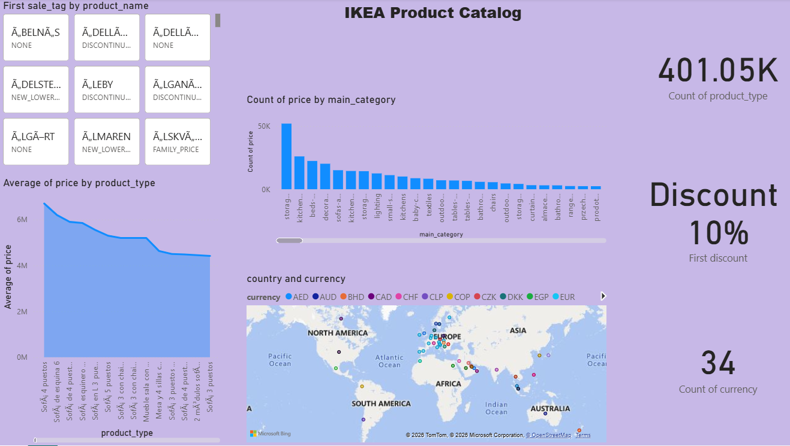

# 🛍️ IKEA Product Catalog Dashboard (Power BI)

---

## 📌 Project Overview
This project presents an interactive Power BI dashboard analyzing the IKEA product catalog.  
The dashboard provides insights into product pricing, categories, discounts, global distribution, and currency usage.

It helps stakeholders understand:
- Product category performance  
- Pricing trends  
- Discount strategies  
- Global market presence  
- Product segmentation  

---

## 🖼 Dashboard Preview
ikeadashboard.png

---

# 📈 Key Performance Indicators (KPIs)

| KPI | Value | Description |
|----|----|----|
| Total Product Types | 401.05K | Total number of products available |
| Discount Rate | 10% | First recorded discount percentage |
| Currency Count | 34 | Total currencies used globally |

---

# 🌍 Global Distribution & Currency Analysis

The dashboard includes a map visualization showing product presence across countries with different currencies.

### Regions Covered

| Region |
|------|
| North America |
| South America |
| Europe |
| Africa |
| Asia |
| Australia |

### Key Insights

* IKEA has a strong global presence 🌍  
* Europe and North America show higher concentration  
* Multiple currencies indicate international operations  

---

# 📊 Category-wise Product Distribution

This bar chart shows the count of products by main category.

### Top Categories

| Category |
|---------|
| Storage |
| Beds |
| Sofas |
| Tables |
| Chairs |

### Insights

* Storage and furniture categories dominate  
* Focus is on home essentials  
* Some categories have lower product availability  

---

# 💰 Average Price by Product Type

This visualization shows how average price varies across product types.

### Insights

* Initial product types show higher average prices  
* Prices gradually decrease across categories  
* Indicates a mix of:
  - Premium products  
  - Affordable options  

---

# 🏷 Product Segmentation (First Sale Tag)

The dashboard includes filters based on product pricing strategy.

### Tags Included

| Tag |
|----|
| Discounted |
| New Lower Price |
| Family Price |
| None |

### Insights

* Helps identify pricing strategies  
* Enables targeted product analysis  
* Shows how IKEA segments products for customers  

---

# 🎛 Dashboard Filters

Users can interact with the dashboard using:

### Product Name Filter
- Select specific products  

### First Sale Tag Filter
- Discounted  
- New Lower Price  
- Family Price  

---

# 📊 Features of the Dashboard

* Interactive Power BI visuals  
* Category-wise product analysis  
* Global map visualization  
* Pricing trend insights  
* Product segmentation filters  
* Clean and user-friendly interface  

---

# 🧠 Business Insights

### 1️⃣ Product Diversity
IKEA offers 400K+ products, indicating a wide catalog range.

### 2️⃣ Pricing Strategy
Combination of premium and affordable products ensures broad customer reach.

### 3️⃣ Global Presence
Operations across multiple continents and currencies show strong international reach.

### 4️⃣ Category Focus
Major focus on furniture and storage solutions.

### 5️⃣ Discount Strategy
Use of discounts helps in customer attraction and sales growth.

---

# 🛠 Tools & Technologies

| Tool | Purpose |
|----|----|
| Power BI | Data visualization |
| Dataset | Product catalog data |
| DAX | Measures & calculations |
| GitHub | Project hosting |

---

# 📂 Project Structure

IKEA-Product-Dashboard  
│  
├── Dataset  
│   └── ikea_data.csv  
│  
├── PowerBI  
│   └── ikea_dashboard.pbix  
│  
├── Images  
│   └── dashboard.png  
│  
└── README.md  

---

# 🚀 How to Use

1. Download the .pbix file  
2. Open in Power BI Desktop  
3. Use filters to explore:
   - Product categories  
   - Pricing trends  
   - Global distribution  
4. Analyze insights interactively  

---

# 📌 Future Improvements

* Add time-based pricing trends  
* Include sales and revenue data  
* Add customer behavior analysis  
* Implement forecasting models  

---

# 👩‍💻 Author

Vetali Mittal  
Economics Honours Student | Data Enthusiast | Power BI Learner  

---
